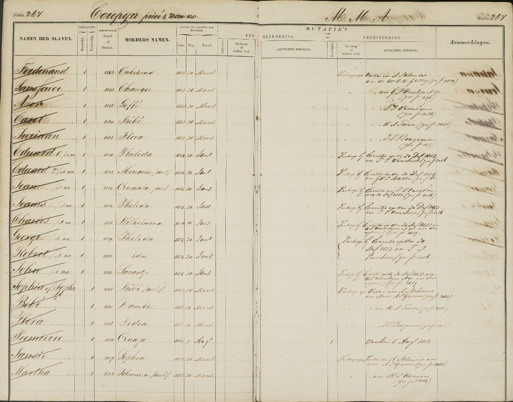
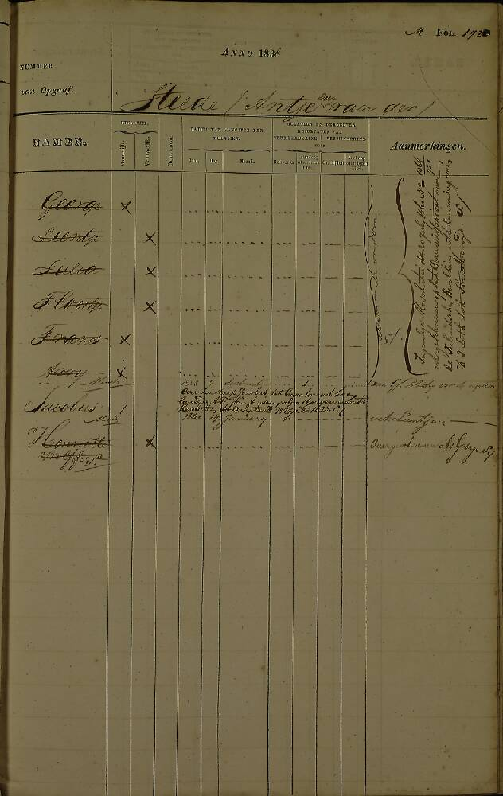
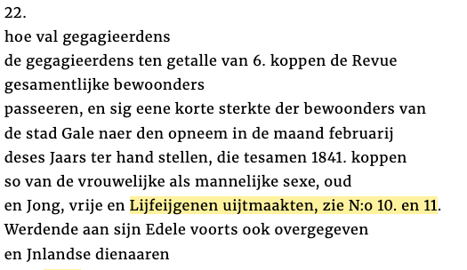
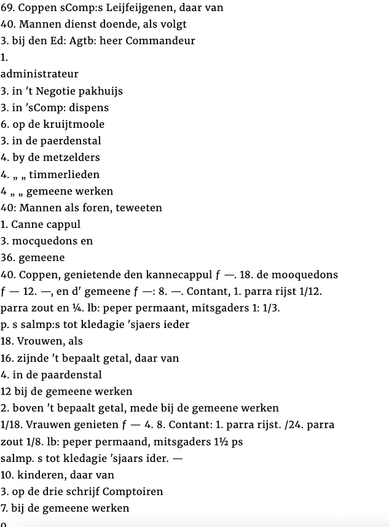
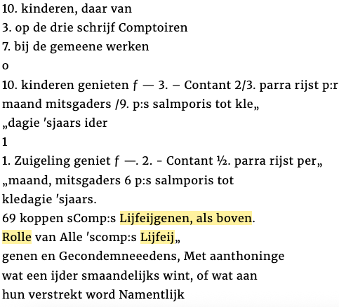
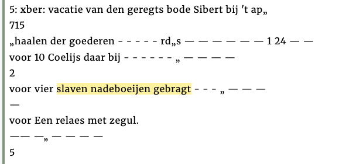

# Modelling the enslaved as historical persons

Rick Mourits, Thunnis van Oort, Kay Pepping, Pascal Konings, Britt van Duijvenvoorde, Liliana Melgar

1. [Introduction](#1-introduction)
2. [Specification](#2-specification)
3. [Evaluation of the PiCo model](#3-evaluation-of-the-pico-model)
4. [Integration of existing schemas](#4-integration-of-existing-schemas)
   - [4.1. PiCo-M](#41-pico-m)
   - [4.2. Enslaved.org](#42-enslavedorg)
   - [4.3. Exploring Slave Trade in Asia (ESTA)](#43-exploring-slave-trade-in-asia-esta)
   - [4.4. Person Name Vocabulary](#44-person-name-vocabulary)
   - [4.5. Schema.org](#45-schemaorg)
   - [4.6. Transports](#46-transports)
   - [4.7. WikiData](#47-WikiData)
   - [4.8. Required specialised concepts](#48-required-specialised-concepts)
   - [4.9. Required specialised properties](#49-required-specialised-properties)
   - [4.10. Taxonomies and thesauri](#410-taxonomies-and-thesauri)
5. [Exentensions of the PiCo model](#5-exentensions-of-the-PiCo-model)
   - [5.1. Vanilla PiCo model](#51-vanilla-pico-model)
   - [5.2. Enslavement status](#52-enslavement-status)
   - [5.3. Relation enslaved - enslaver](#53-relation-enslaved---enslaver)
   - [5.4. Reason for observation](#54-reason-for-observation)
   - [5.5. Relation owner - legal representative](#55-relation-owner---legal-representative)
   - [5.6. Relation enslaved - legal representative](#56-relation-enslaved---legal-representative)
   - [5.7. Plantations (and other organisations)](#57-plantations-and-other-organisations)
   - [5.8. Transports](#58-transports)
   - [5.9. Manumission](#59-manumission)
   - [5.10. Group observations](#510-group-observations)

 

## 1. Introduction

In this document, we reflect on how to implement historical person data on enslaved people as Linked Data. Our aim is to use the [PiCo model](https://www.personsincontext.org) to fit all historical person observations by using the guidelines for flexible and extended reuse the model.

In order to effectively communicate (historical) person data, the [Dutch Center for Family History (CBG)](https://cbg.nl) has developed the Persons in Context (PiCo) model [(Woltjer et al., 2024)](https://doi.org/10.51964/hlcs19312), on the basis of the ROAR model developed by Menno den Engelse and Leon van Wissen [(2021)](https://www.leonvanwissen.nl/project/roar/). The PiCo model states how information on common factors in historical person observations, such as age, dates, occupations, relations between family members, roles in source documents, etc. should be described.

The PiCo model reuses as many existing URIs as possible to describe historical person data, as it encourages communities to give the same name to the same entity. This prevents discussions on naming and describing resources that have already been authoritatively defined. Moreover, this makes data more findable as people can search on one common term, rather than having to waste time on resolving a potentially endless list of variations. And, perhaps most importantly, it enforces stringent definitions of properties and resources that can be used for efficient knowledge interference.

 

## 2. Specifications
- Persons are modelled as standardised in the Persons in Context model (PiCo-M)
- Where possible, extensions to the model are based on existing vocabularies
- Extensions to the model follow the logic of concentric description: where possible global (Schema.org), otherwise domain-specific (Enslaved.org), or specialised (Person Name Vocabulary)
- New extensions can be introduced with consensus between the HDSC, Globalised, and ESTA
- The model should be easily transposable to the Enslaved.org data model

 

## 3. Evaluation of the PiCo model
During three meetings in Q1 2025, we identified the following issues in implementing PiCo-M for historical person data on slave history:

|  | Issue | Description	  |
|--|-------|----------------|
| 1. | [PiCo-M](#41-pico-m) | A basic descriptive model is necessary to describe observations and reconstructions of enslaved persons |
| 2. | Age categories[1](#41-pico-m),[2](#42-enslavedorg) | It is not uncommon that person observations of enslaved persons only contain an age category (child vs adult) instead of an exact age  |
| 3. | [Enumerations](#41-pico-m) | Certain sources contain (only) information about groups of enslaved persons as part of an enumeration |
| 4. | [Name changes](#41-pico-m) | Emancipation and manumission records refer to one event, but these records contain two observations for the same (enslaved and free) person with different characteristics |
| 5. | [Observation or reconstruction](#41-pico-m) | The distinction between person observations and person reconstructions is not always clear with old data, as the preserved datasets are an undocumented mix of original and enriched data |
| 6. | [Person names](#44-person-name-vocabulary) | Person names can contain African names, Christian names, and person descriptions |
| 7. | [Person status](#42-enslavedorg) | There is no property to describe whether someone is enslaved or free |
| 8. | [Reasons for observation](#42-enslavedorg) | Enslavement, emancipation, manumission, and trade are necessary to model the start and/or end of observations |
| 9. | Relations[1](#42-enslavedorg),[2](#49-required-specialised-properties) | There are currently no properties to describe relationships between   - slaveholder and enslaved,   - freed persons and ["straatvoogden"](https://www.nationaalarchief.nl/onderzoeken/zoekhulpen/suriname-vrijgelaten-slaven-manumissies-1832-1863), or   - slave owners and their legal representative.   The latter group includes women who are legally represented by their husband, also known as nomine uxoris |
| 10. | Slaveholders[1](#45-schemaorg),[2](#47-wikidata) | Slaveholders can also be organisations. For example, a plantation or company |
| 11. | Social categories[1](#42-enslavedorg),[2](#49-required-specialised-properties) | Most sources contain categorisations by race, class, or religion |
| 12. | Taxonomies and Thesauri[1](#47-wikidata),[2](#410-taxonomies-and-thesauri) | Scholars have collected extensive lists of data related to slavery, such as an [overview of plantations in Suriname](https://hdl.handle.net/10622/4VOJYS) or an [overview of social groups in the archives of the Dutch East India Company](https://hdl.handle.net/10622/5LRS03) |
| 13. | Transports[1](#42-enslavedorg),[2](#45-schemaorg),[3](#43-exploring-slave-trade-in-asia-esta),[4](#46-slavevoyages)  | Multiple parties collect information on slave voyages, but there is no authorative Linked Data model for slave voyages |
| 14. | [Toponyms](#44-person-name-vocabulary) | Person names of enslaved can contain toponyms. The exact meaning of these toponyms is ambiguous, but the toponym are required to reconstruct persons |
| 15. | [Type of enslavement](#42-enslavedorg) | There is no property to describe the type of enslavement |
| 16. | [Unspecified groups](#48-required-specialised-classes) | Some sources contain only observations for groups of enslaved |

 

## 4. Integration of existing schemas

For each of these issues, we surveyed whether required properties and entities were available provided by the [Persons in Context model](https://personsincontext.org), [Enslaved.org](https://docs.enslaved.org/), [Person Name Vocabulary](https://www.lodewijkpetram.nl/vocab/pnv/doc/), [Schema.org](https://schema.org), and [Wikidata](https://www.wikidata.org). Furthermore, we studied the existing solutions for modelling slave voyages in tabular format by [Exploring Slave Trade in Asia (ESTA)](https://exploringslavetradeinasia.com/) and [SlaveVoyages](https://www.slavevoyages.org/). For each of these solutions we evaluated the viability for reuse in Q1 and Q2 2025.

### 4.1. PiCo-M
The logic of the [Persons in Context model](https://personsincontext.org) is easily applicable to data on enslaved persons. However, PiCo-M needs to be extended.

|  | Issue | Description	  | Reuse |
|--|-------|----------------|-------|
| 1. | PiCo-M | The logic of the Persons in Context model is easily applicable to data on enslaved persons | **yes** |
| 2. | Age categories | hasAge models exact ages   _**We suggest not to use hasAge to refer to age categories**_ | **no** |
| 3. | Enumerations | Each individual in an enumeration can be modelled as a person observation, provided that such enumerations contain descriptive information. For example, 5 underage, male enslaved belonging to J. Janssen | **yes** |
| 4. | Name changes | An emancipation or manumission record should be seen as two observations: one of an enslaved person until emancipation/manumission, and a second of a free person from emancipation/manumission. These two observations are joint via owl:sameAs. | **yes** |
| 5. | Observation or reconstruction | Person observations are meant to model a record and stay close to the source. Person reconstructions combines information and allow for interpretation.   _**In case the relation to the source is lost, and records probably contain far-reaching interpretation by the data provider, we suggest to model the database as a reconstruction**_ | **yes** |

### 4.2. Enslaved.org
[Enslaved.org](https://docs.enslaved.org/) contains multiple useful properties and entities to model enslavement and its context. However, not all required properties and entities are available in the Enslaved.org environment and relations cannot be reused.

|  | Issue | Description	  | Reuse |
|--|-------|----------------|-------|
| 2. | Age categories | [_hasAgeCategory_](https://lod.enslaved.org/wiki/Property:P4) is used to model age groups. This property has four categories: [_Infant Age Group_](https://lod.enslaved.org/wiki/Q426), [_Child Age Group_](https://lod.enslaved.org/wiki/Q427), [_Adult Age Group_](https://lod.enslaved.org/wiki/Q425), and [_Older Person Age Group_](https://lod.enslaved.org/wiki/Q429) |  **yes** | 
| 7. | Person status | [_hasPersonStatus_](https://lod.enslaved.org/wiki/Property:P33) is used to model person status. This property has seven categories: [_Enslaved Person_](https://lod.enslaved.org/wiki/Q109), [_Free Person_](https://lod.enslaved.org/wiki/Q117), [_Freed Person_](https://lod.enslaved.org/wiki/Q386), [_Indentured Person or Pawn_](https://lod.enslaved.org/wiki/Q166), [_Enslaver or Owner_](https://lod.enslaved.org/wiki/Q112), [_Liberated African_](https://lod.enslaved.org/wiki/Q159275), [_Liminal Status Person_](https://lod.enslaved.org/wiki/Q192). This category is too specific to be broadly used, and too broad to be used specifically.   _**We suggest to use the property and three concepts: [_Enslaved Person_](https://lod.enslaved.org/wiki/Q109), [_Free Person_](https://lod.enslaved.org/wiki/Q117), [_Liminal Status Person_](https://lod.enslaved.org/wiki/Q192)**_ | **yes** |
| 8. | Reasons for observations | [_hasEventType_](https://lod.enslaved.org/wiki/Property:P30) contains 27 events: [_Advertisement_](https://lod.enslaved.org/wiki/Q907443), [_Appraisal_](https://lod.enslaved.org/wiki/Q647904), [_Baptism or Naming Ceremony_](https://lod.enslaved.org/wiki/Q149), [_Birth_](https://lod.enslaved.org/wiki/Q147), _Burial or Interment_, [_Death_](https://lod.enslaved.org/wiki/Q148), [_Disappearance_](https://lod.enslaved.org/wiki/Q154), [_Disembarkation_](https://lod.enslaved.org/wiki/Q10088), _Education_, [_Emancipation or Manumission_](https://lod.enslaved.org/wiki/Q281), [_Embarkation_](https://lod.enslaved.org/wiki/Q10087), [_Employment, Apprenticeship, or Indenture_](https://lod.enslaved.org/wiki/Q156), [_Enslavement_](https://lod.enslaved.org/wiki/Q151), [_Legal Proceeding_](https://lod.enslaved.org/wiki/Q155), [_Marriage_](https://lod.enslaved.org/wiki/Q150), [_Membership_](https://lod.enslaved.org/wiki/Q473), [_Mention_](https://lod.enslaved.org/wiki/Q856060), [_Military Service_](https://lod.enslaved.org/wiki/Q164), [_Mortgage_](https://lod.enslaved.org/wiki/Q298746), [_Narrative_](https://lod.enslaved.org/wiki/Q157), [_Resistance or Rebellion_](https://lod.enslaved.org/wiki/Q357), [_Registration_](https://lod.enslaved.org/wiki/Q250), [_Relocation_](https://lod.enslaved.org/wiki/Q161), [_Residence_](https://lod.enslaved.org/wiki/Q159), [_Sale or Transfer_](https://lod.enslaved.org/wiki/Q153), [_Trade_](https://lod.enslaved.org/wiki/Q1147583), [_Voyage_](https://lod.enslaved.org/wiki/Q146). These events can be used to indicate to indicate why observation started and ended | **yes** |
| 9. | Relations | Relations are modelled as a concept with [_InterAgent Relationship_](https://lod.enslaved.org/wiki/Q463) that requires [additional triples](https://lod.enslaved.org/wiki/Property:P39) to describe the characteristics of the relationship. This approach is incongruent with the PiCo model that uses properties to directly relate two people. | **no** |
| 11. | Social Categories | [_hasRaceorColor_](https://lod.enslaved.org/wiki/Property:P32) is used to model racial characteristics. This narrow focus is problematic as categorisation/description of enslaved in Africa and the Indian Ocean world is often also based on religion, caste, class, etc. | **no** |
| 13. | Transports | [_Voyage_](https://lod.enslaved.org/wiki/Q146) is used to describe a long distance transport of enslaved persons. This entity is more focused/limited than [_sdo:TravelAction_](https://schema.org/TravelAction) and contains no associated properties. | **no** |
| 15. | Type of enslavement | [_hasPersonStatus_](https://lod.enslaved.org/wiki/Property:P33) can be used to model the type of enslavement. However, the seven categories: [_Enslaved Person_](https://lod.enslaved.org/wiki/Q109), [_Free Person_](https://lod.enslaved.org/wiki/Q117), [_Freed Person_](https://lod.enslaved.org/wiki/Q386), [_Indentured Person or Pawn_](https://lod.enslaved.org/wiki/Q166), [_Enslaver or Owner_](https://lod.enslaved.org/wiki/Q112), [_Liberated African_](https://lod.enslaved.org/wiki/Q159275), [_Liminal Status Person_](https://lod.enslaved.org/wiki/Q192) are too specific to be broadly used, and too broad to be used specifically.   _**We suggest to use the property and three concepts: [_Enslaved Person_](https://lod.enslaved.org/wiki/Q109), [_Free Person_](https://lod.enslaved.org/wiki/Q117), [_Liminal Status Person_](https://lod.enslaved.org/wiki/Q192)**_ | **yes** |

### 4.3. Exploring Slave Trade in Asia (ESTA)
[Exploring Slave Trade in Asia (ESTA)](https://exploringslavetradeinasia.com/) models the same data as [SlaveVoyages](https://www.slavevoyages.org/) with a data model that is similar to [SlaveVoyages](https://www.slavevoyages.org/) and [sdo:TravelAction](https://schema.org/TravelAction). However, ESTA operationalizes transports a bit different than the other two parties.

|  | Issue | Description	  | Reuse |
|--|-------|----------------|-------|
| 13. | Slave voyages | ESTA has no own RDF data model and the required properties to model voyages are available in the Schema.org concept [_sdo:TransferAction_](https://schema.org/TransferAction). ESTA adds a distinction between SubVoyages and the MainVoyage, which can be modelled via rdfs:subClassOf | **no** |

### 4.4. Person Name Vocabulary
[Person Name Vocabulary](https://www.lodewijkpetram.nl/vocab/pnv/doc/) has the required properties to model extra information on names. 

|  | Issue | Description	  | Reuse |
|--|-------|----------------|-------|
| 6. | Person names | Person names can contain African names, Christian names, and person descriptions. These can be modelled with [_nameSpecification_](https://www.lodewijkpetram.nl/vocab/pnv/doc/#nameSpecification) | **yes** |
| 14. | Toponyms | For ontologies, we need an easy way to extract place information from names. We asked pnv for an extension of the model, which they promised to provide. | **yes** |

### 4.5. Schema.org
[Schema.org](https://schema.org) has the concepts [_Organization_](https://schema.org/Organization) and [sdo:TransferAction](https://schema.org/TransferAction) that can be used to describe non-private owners and slave voyages. 

|  | Issue | Description	  | Reuse |
|--|-------|----------------|-------|
| 10. | Slaveholders | [_Organization_](https://schema.org/Organization) is a type in Schema.org with relevant properties like [_name_](https://schema.org/name) and [_location_](https://schema.org/location) to describe the organization. Furthermore, the relation between the organization and its staff can be described using the broad property [_affiliation_](https://schema.org/affiliation) or specified using properties [_owns_](https://schema.org/owns), [_employee_](https://schema.org/employee), [_founder_](https://schema.org/founder), [_funder_](https://schema.org/funder), or [_member_](https://schema.org/member). [_Organization_](https://schema.org/Organization) contains no property to model the relation to the enslaved or the type of organization.   _**We suggest to use the properties IsEnslaverOf / IsEnslavedBy and entries in WikiData to address this**_  | **yes** |
| 13. | Slave voyages | Voyages can be modelled using _[sdo:TransferAction](https://schema.org/TransferAction)_. The concept is awkwardly named, but contains the relevant properties like _[sdo:fromLocation](https://schema.org/fromLocation)_, _[sdo:toLocation](https://schema.org/toLocation)_, _[sdo:startTime](https://schema.org/startTime)_, and _[sdo:endTime](https://schema.org/endTime)_ to describe the voyage as well as _[sdo:instrument](https://schema.org/instrument)_ and _[sdo:agent](https://schema.org/agent)_ to describe the vessel and captain. However, the property to describe transported enslaved persons _[sdo:object](https://schema.org/object)_ is ill-fitted and should not be used .   _**We suggest to use SlaveVoyage as a secondary concept and to use the property ... to describe the transported**_| **yes** |

### 4.6. Transports
[SlaveVoyages](https://www.slavevoyages.org/) models transports of enslaved with a data model similar to [SlaveVoyages](https://www.slavevoyages.org/) and [sdo:TravelAction](https://schema.org/TravelAction). This makes it unnecessary to reuse entities or properties from [SlaveVoyages](https://www.slavevoyages.org/).

|  | Issue | Description	  | Reuse |
|--|-------|----------------|-------|
| 13. | Slave voyages | SlaveVoyages has no own RDF data model and the required properties to model voyages are available in the Schema.org concept [_sdo:TravelAction_](https://schema.org/TravelAction). SlaveVoyages calls the [_sdo:TravelAction_](https://schema.org/TravelAction a SlaveVoyage, which is more specified than [_sdo:TravelAction_](https://schema.org/TravelAction and thus harder to reuse in other conctexts. | **no** |

### 4.7. WikiData
[Wikidata](https://wikidata.org) can be used to specify the types of organization that we encounter as enslavers. It enables data providers to describe the owner as detailed as they want, and provides them with an opportunity to add new types of owners if needed. However, WikiData is not suited to maintain curated lists, taxonomies, and thesauri.

|  | Issue | Description	  | Reuse |
|--|-------|----------------|-------|
| 10. | Slaveholders | WikiData can be used to specify the type of organization, and give a definiton of that organization. For example a [_plantation_](https://www.wikidata.org/entity/Q188913) | **yes** |
| 12. | Taxonomies and Thesauri | Data providers can use the provided properties to describe their data using lists and thesauri. These lists and thesauri should only be used if they are part of a curated collection, as this ascertain the long-term availability and stability of collections. This makes WikiData unsuited for hosting thesauri | **no** |

### 4.8. Required specialised concepts
The concept GroupObservation is introduced to model groups where it is impossible to model a [picom:PersonObservation](https://personsincontext.org/model/#PersonObservation).

|  | Issue | Description	 | Concept | 
|--|-------|----------------|---------|
| 16. | Unspecified groups | The concept GroupObservation is used to describe groups. A GroupObservation can NEVER replace a [picom:PersonObservation](https://personsincontext.org/model/#PersonObservation), but are meant to add extra content information or model demographic information that cannot be modelled using [picom:PersonObservation](https://personsincontext.org/model/#PersonObservation). Related GroupObservations can be joint in a GroupReconstruction by the logic introduced in [(Roar)](https://www.leonvanwissen.nl/project/roar/) | **GroupObservation**   **GroupReconstruction** |

### 4.9. Required specialised properties
Two sets of reflexive are added to model enslavement and legal representation. Furthermore, we introduce the term hasSocialIdentity to describe any type of social categorization.

|  | Issue | Description	 | Property | 
|--|-------|----------------|----------|
| 9. | Relations | The properties isEnslavedBy and isEnslaverOf are used to describe the relations between enslavers and enslaved. Similarly, the properties isLegallyRepresentedBy and legallyRepresents are used to model legal representatives of enslaved (straatvoogden), owners (spouse in nomine uxoris), or specialized legal representatives. | **isEnslavedBy**   **isEnslaverOf**   **isLegallyRepresentedBy**   **legallyRepresents** |
| 11. | Social categories | The categorization of enslaved people reaches far beyond their race and color and was also dependent on their religion, caste, and class. Therefore, we introduce the term hasSocialIdentity as a catch-all property for any social categorization | **hasSocialIdentity** |

### 4.10. Taxonomies and thesauri
Taxonomies and thesauri are not part of the extend PiCo model. However, data providers are free to use them, as long as they are part of curated collections.

|  | Issue | Description	 | Entities | 
|--|-------|----------------|----------|
| 12. | Taxonomies and Thesauri | Data providers can use the provided properties to describe their data using lists and thesauri. These lists and thesauri should only be used if they are part of a curated collection, as this ascertains the long-term availability and stability of collections. | - |

 

## 5. Exentensions of the PiCo model
Based on the [Evaluation of the PiCo model](#evaluation-of-the-pico-model), we made the following extensions to the PiCo model. These extensions were discussed in Q2 2025 and presented at the DH Benelux in June.

 

## 5.1. Vanilla PiCo model
We use a folio from the Surinamese slave registers to describe the extensions to the base PiCo model in sections 5.1 to 5.4. The example underneath contains the owner and the first two listed enslaved persons. The base PiCo model can describe: 
- that these persons are observed,
- their name, sex, and date of birth,
- and that the mother of Sans Souci is called Changoe.

However, other important characteristics and relationships between person observations cannot be modelled.

| Subject | Property | Object |
|----|----|----|
| example:person1 | [a](https://www.w3.org/1999/02/22-rdf-syntax-ns#type) | [picom:PersonObservation](https://personsincontext.org/model/#PersonObservation) ; |
| | [sdo:gender](https://schema.org/gender) | [sdo:Male](https://schema.org/Male) ; |
| | [sdo:name](https://schema.org/name) | "Ferdinand" ; |
| | [sdo:givenName](https://schema.org/givenName) | "Ferdinand" ; |
| | [sdo:birthDate](https://schema.org/birthDate) | "1803"^^xsd:gYear . |
| example:person2 | [a](https://www.w3.org/1999/02/22-rdf-syntax-ns#type) | [picom:PersonObservation](https://personsincontext.org/model/#PersonObservation) ; |
| | [sdo:parent](https://schema.org/parent) | **example:person3** ; |
| | [sdo:name](https://schema.org/name) | "Sans Souci" ; |
| | [sdo:givenName](https://schema.org/givenName) | "Sans Souci" ; |
| | [sdo:birthDate](https://schema.org/birthDate) | "1813"^^xsd:gYear . |
| example:person3 | [a](https://www.w3.org/1999/02/22-rdf-syntax-ns#type) | [picom:PersonObservation](https://personsincontext.org/model/#PersonObservation) ; |
| | [sdo:child](https://schema.org/child) | **example:person2** ; |
| | [sdo:gender](https://schema.org/gender) | [sdo:Female](https://schema.org/Female) ; |
| | [sdo:name](https://schema.org/name) | "Changoe" ; |
| | [sdo:givenName](https://schema.org/givenName) | "Changoe" . |
| example:person4 | [a](https://www.w3.org/1999/02/22-rdf-syntax-ns#type) | [picom:PersonObservation](https://personsincontext.org/model/#PersonObservation) ; |
| | [sdo:name](https://schema.org/name) | "M.M.A. Coupijn" ; |
| | [sdo:givenName](https://schema.org/givenName) | "M.M.A." ; |
| | [sdo:familyName](https://schema.org/familyName) | "Coupijn" . |

 

### 5.2. Enslavement status
We use the Enslaved.org property for hasPersonStatus [ed:P33](https://lod.enslaved.org/wiki/Property:P33) to note which that persons 1 and 2 are [Enslaved](https://lod.enslaved.org/wiki/Q109) and the [Liminal](https://lod.enslaved.org/wiki/Q192) status of person 3, the mother of person 2. 

| Subject | Property | Object |
|----|----|----|
| example:person1 | [a](https://www.w3.org/1999/02/22-rdf-syntax-ns#type) | [picom:PersonObservation](https://personsincontext.org/model/#PersonObservation) ; |
| | [sdo:gender](https://schema.org/gender) | [sdo:Male](https://schema.org/Male) ; |
| | [sdo:name](https://schema.org/name) | "Ferdinand" ; |
| | [sdo:givenName](https://schema.org/givenName) | "Ferdinand" ; |
| | [sdo:birthDate](https://schema.org/birthDate) | "1803"^^xsd:gYear ; |
| | [ed:P33](https://lod.enslaved.org/wiki/Property:P33) | [ed:Q109](https://lod.enslaved.org/wiki/Q109) . |
| example:person2 | [a](https://www.w3.org/1999/02/22-rdf-syntax-ns#type) | [picom:PersonObservation](https://personsincontext.org/model/#PersonObservation) ; |
| | [sdo:parent](https://schema.org/parent) | **example:person3** ; |
| | [sdo:name](https://schema.org/name) | "Sans Souci" ; |
| | [sdo:givenName](https://schema.org/givenName) | "Sans Souci" ; |
| | [sdo:birthDate](https://schema.org/birthDate) | "1813"^^xsd:gYear ; |
| | [ed:P33](https://lod.enslaved.org/wiki/Property:P33) | [ed:Q109](https://lod.enslaved.org/wiki/Q109) ; |
| | [ed:P33](https://lod.enslaved.org/wiki/Property:P33) | [ed:Q109](https://lod.enslaved.org/wiki/Q109) . |
| example:person3 | [a](https://www.w3.org/1999/02/22-rdf-syntax-ns#type) | [picom:PersonObservation](https://personsincontext.org/model/#PersonObservation) ; |
| | [sdo:child](https://schema.org/child) | **example:person2** ; |
| | [sdo:gender](https://schema.org/gender) | [sdo:Female](https://schema.org/Female) ; |
| | [sdo:name](https://schema.org/name) | "Changoe" ; |
| | [sdo:givenName](https://schema.org/givenName) | "Changoe" ; |
| | [ed:P33](https://lod.enslaved.org/wiki/Property:P33) | [ed:Q109](https://lod.enslaved.org/wiki/Q192) . |
| example:person4 | [a](https://www.w3.org/1999/02/22-rdf-syntax-ns#type) | [picom:PersonObservation](https://personsincontext.org/model/#PersonObservation) ; |
| | [sdo:name](https://schema.org/name) | "M.M.A. Coupijn" ; |
| | [sdo:givenName](https://schema.org/givenName) | "M.M.A." ; |
| | [sdo:familyName](https://schema.org/familyName) | "Coupijn" . |

 

### 5.3. Relation enslaved - enslaver
We use the properties isEnslavedBy and isEnslaverOf to model the relationship between enslaver and enslaved. 

| Subject | Property | Object |
|----|----|----|
| example:person1 | [a](https://www.w3.org/1999/02/22-rdf-syntax-ns#type) | [picom:PersonObservation](https://personsincontext.org/model/#PersonObservation) ; |
| | XXX:isEnslavedBy | **example:person4** |
| | [sdo:gender](https://schema.org/gender) | [sdo:Male](https://schema.org/Male) ; |
| | [sdo:name](https://schema.org/name) | "Ferdinand" ; |
| | [sdo:givenName](https://schema.org/givenName) | "Ferdinand" ; |
| | [sdo:birthDate](https://schema.org/birthDate) | "1803"^^xsd:gYear ; |
| | [ed:P33](https://lod.enslaved.org/wiki/Property:P33) | [ed:Q109](https://lod.enslaved.org/wiki/Q109) . |
| example:person2 | [a](https://www.w3.org/1999/02/22-rdf-syntax-ns#type) | [picom:PersonObservation](https://personsincontext.org/model/#PersonObservation) ; |
| | [sdo:parent](https://schema.org/parent) | **example:person3** ; |
| | XXX:isEnslavedBy | **example:person4** |
| | [sdo:name](https://schema.org/name) | "Sans Souci" ; |
| | [sdo:givenName](https://schema.org/givenName) | "Sans Souci" ; |
| | [sdo:birthDate](https://schema.org/birthDate) | "1813"^^xsd:gYear ; |
| | [ed:P33](https://lod.enslaved.org/wiki/Property:P33) | [ed:Q109](https://lod.enslaved.org/wiki/Q109) ; |
| | [ed:P33](https://lod.enslaved.org/wiki/Property:P33) | [ed:Q109](https://lod.enslaved.org/wiki/Q109) . |
| example:person3 | [a](https://www.w3.org/1999/02/22-rdf-syntax-ns#type) | [picom:PersonObservation](https://personsincontext.org/model/#PersonObservation) ; |
| | [sdo:child](https://schema.org/child) | **example:person2** ; |
| | [sdo:gender](https://schema.org/gender) | [sdo:Female](https://schema.org/Female) ; |
| | [sdo:name](https://schema.org/name) | "Changoe" ; |
| | [sdo:givenName](https://schema.org/givenName) | "Changoe" ; |
| | [ed:P33](https://lod.enslaved.org/wiki/Property:P33) | [ed:Q109](https://lod.enslaved.org/wiki/Q192) . |
| example:person4 | [a](https://www.w3.org/1999/02/22-rdf-syntax-ns#type) | [picom:PersonObservation](https://personsincontext.org/model/#PersonObservation) ; |
| | XXX:isEnslaverOf | **example:person1**,   **example:person2** |
| | [sdo:name](https://schema.org/name) | "M.M.A. Coupijn" ; |
| | [sdo:givenName](https://schema.org/givenName) | "M.M.A." ; |
| | [sdo:familyName](https://schema.org/familyName) | "Coupijn" . |

Moreover, we advise to also add the beginning and end date of the observed enslaved relations with a blank node using [sdo:startDate](https://schema.org/startDate) and [sdo:endDate](https://schema.org/endDate), as slavery relations can change over time. 

| Subject | Property | Object | Property Blank Node | Object Blank Node |
|----|----|----|----|----|
| example:person1 | [a](https://www.w3.org/1999/02/22-rdf-syntax-ns#type) | [picom:PersonObservation](https://personsincontext.org/model/#PersonObservation) ; | | |
| | XXX:isEnslavedBy | [ | [rdf:value](http://www.w3.org/1999/02/22-rdf-syntax-ns#value) | **example:person4** ; |
| | | | [sdo:startDate](https://schema.org/startDate) | " 1851"^^xsd:gYear ; |
| | | | [sdo:endDate](https://schema.org/endDate) | "1853-03-30"^^xsd:date ; |
| | [sdo:gender](https://schema.org/gender) | [sdo:Male](https://schema.org/Male) ; | | |
| | [sdo:name](https://schema.org/name) | "Ferdinand" ; | | |
| | [sdo:givenName](https://schema.org/givenName) | "Ferdinand" ; | | |
| | [sdo:birthDate](https://schema.org/birthDate) | "1803"^^xsd:gYear ; | | |
| | [ed:P33](https://lod.enslaved.org/wiki/Property:P33) | [ed:Q109](https://lod.enslaved.org/wiki/Q109) . | | |
| example:person2 | [a](https://www.w3.org/1999/02/22-rdf-syntax-ns#type) | [picom:PersonObservation](https://personsincontext.org/model/#PersonObservation) ; | | |
| | [sdo:parent](https://schema.org/parent) | **example:person3** ; | | |
| | XXX:isEnslavedBy | [ | [rdf:value](http://www.w3.org/1999/02/22-rdf-syntax-ns#value) | **example:person4** ; |
| | | | [sdo:startDate](https://schema.org/startDate) | " 1851"^^xsd:gYear ; |
| | | | [sdo:endDate](https://schema.org/endDate) | "1853-03-30"^^xsd:date ; |
| | [sdo:name](https://schema.org/name) | "Sans Souci" ; | | |
| | [sdo:givenName](https://schema.org/givenName) | "Sans Souci" ; | | |
| | [sdo:birthDate](https://schema.org/birthDate) | "1813"^^xsd:gYear ; |
| | [ed:P33](https://lod.enslaved.org/wiki/Property:P33) | [ed:Q109](https://lod.enslaved.org/wiki/Q109) ; | | |
| | [ed:P33](https://lod.enslaved.org/wiki/Property:P33) | [ed:Q109](https://lod.enslaved.org/wiki/Q109) . | | |
| example:person3 | [a](https://www.w3.org/1999/02/22-rdf-syntax-ns#type) | [picom:PersonObservation](https://personsincontext.org/model/#PersonObservation) ; | | |
| | [sdo:child](https://schema.org/child) | **example:person2** ; | | |
| | [sdo:gender](https://schema.org/gender) | [sdo:Female](https://schema.org/Female) ; | | |
| | [sdo:name](https://schema.org/name) | "Changoe" ; | | |
| | [sdo:givenName](https://schema.org/givenName) | "Changoe" ; | | |
| | [ed:P33](https://lod.enslaved.org/wiki/Property:P33) | [ed:Q109](https://lod.enslaved.org/wiki/Q192) . | | |
| example:person4 | [a](https://www.w3.org/1999/02/22-rdf-syntax-ns#type) | [picom:PersonObservation](https://personsincontext.org/model/#PersonObservation) ; | | |
| | XXX:isEnslaverOf | [ | [rdf:value](http://www.w3.org/1999/02/22-rdf-syntax-ns#value) | **example:person1** ; |
| | | | [sdo:startDate](https://schema.org/startDate) | " 1851"^^xsd:gYear ; |
| | | | [sdo:endDate](https://schema.org/endDate) | "1853-03-30"^^xsd:date ; |
| | XXX:isEnslaverOf | [ | [rdf:value](http://www.w3.org/1999/02/22-rdf-syntax-ns#value) | **example:person2** ; |
| | | | [sdo:startDate](https://schema.org/startDate) | " 1851"^^xsd:gYear ; |
| | | | [sdo:endDate](https://schema.org/endDate) | "1853-03-30"^^xsd:date ; |
| | [sdo:name](https://schema.org/name) | "M.M.A. Coupijn" ; | | |
| | [sdo:givenName](https://schema.org/givenName) | "M.M.A." ; | | |
| | [sdo:familyName](https://schema.org/familyName) | "Coupijn" . | | |

 

### 5.4. Reason for observation

We also describe the start and end date of person observations using [sdo:startDate](https://schema.org/startDate) and [sdo:endDate](https://schema.org/endDate). These receive the Enslaved.org property for [hasEventType](https://lod.enslaved.org/wiki/Property:P30) and any of the associated concepts as a blank node: [_Advertisement_](https://lod.enslaved.org/wiki/Q907443), [_Appraisal_](https://lod.enslaved.org/wiki/Q647904), [_Baptism or Naming Ceremony_](https://lod.enslaved.org/wiki/Q149), [_Birth_](https://lod.enslaved.org/wiki/Q147), _Burial or Interment_, [_Death_](https://lod.enslaved.org/wiki/Q148), [_Disappearance_](https://lod.enslaved.org/wiki/Q154), [_Disembarkation_](https://lod.enslaved.org/wiki/Q10088), _Education_, [_Emancipation or Manumission_](https://lod.enslaved.org/wiki/Q281), [_Embarkation_](https://lod.enslaved.org/wiki/Q10087), [_Employment, Apprenticeship, or Indenture_](https://lod.enslaved.org/wiki/Q156), [_Enslavement_](https://lod.enslaved.org/wiki/Q151), [_Legal Proceeding_](https://lod.enslaved.org/wiki/Q155), [_Marriage_](https://lod.enslaved.org/wiki/Q150), [_Membership_](https://lod.enslaved.org/wiki/Q473), [_Mention_](https://lod.enslaved.org/wiki/Q856060), [_Military Service_](https://lod.enslaved.org/wiki/Q164), [_Mortgage_](https://lod.enslaved.org/wiki/Q298746), [_Narrative_](https://lod.enslaved.org/wiki/Q157), [_Resistance or Rebellion_](https://lod.enslaved.org/wiki/Q357), [_Registration_](https://lod.enslaved.org/wiki/Q250), [_Relocation_](https://lod.enslaved.org/wiki/Q161), [_Residence_](https://lod.enslaved.org/wiki/Q159), [_Sale or Transfer_](https://lod.enslaved.org/wiki/Q153), [_Trade_](https://lod.enslaved.org/wiki/Q1147583), [_Voyage_](https://lod.enslaved.org/wiki/Q146).

| Subject | Property | Object | Property Blank Node | Object Blank Node |
|----|----|----|----|----|
| example:person1 | [a](https://www.w3.org/1999/02/22-rdf-syntax-ns#type) | [picom:PersonObservation](https://personsincontext.org/model/#PersonObservation) ; | | |
| | XXX:isEnslavedBy | [ | [rdf:value](http://www.w3.org/1999/02/22-rdf-syntax-ns#value) | **example:person4** ; |
| | | | [sdo:startDate](https://schema.org/startDate) | " 1851"^^xsd:gYear ; |
| | | | [sdo:endDate](https://schema.org/endDate) | "1853-03-30"^^xsd:date ; |
| | [sdo:startDate](https://schema.org/startDate) | [ | [rdf:value](http://www.w3.org/1999/02/22-rdf-syntax-ns#value) | "1837-08-15"^^xsd:date ; |
| | | | [ed:P30](https://lod.enslaved.org/wiki/Property:P30) | [ed:Q153](https://lod.enslaved.org/wiki/Q250) |
| | | ] ; | | |
| | [sdo:endDate](https://schema.org/endDate) | [ | [rdf:value](http://www.w3.org/1999/02/22-rdf-syntax-ns#value) | "1838"^^xsd:gYear ; |
| | | | [ed:P30](https://lod.enslaved.org/wiki/Property:P30) | [ed:Q250](https://lod.enslaved.org/wiki/Q153) |
| | | ] . | | |
| | [sdo:gender](https://schema.org/gender) | [sdo:Male](https://schema.org/Male) ; | | |
| | [sdo:name](https://schema.org/name) | "Ferdinand" ; | | |
| | [sdo:givenName](https://schema.org/givenName) | "Ferdinand" ; | | |
| | [sdo:birthDate](https://schema.org/birthDate) | "1803"^^xsd:gYear ; | | |
| | [ed:P33](https://lod.enslaved.org/wiki/Property:P33) | [ed:Q109](https://lod.enslaved.org/wiki/Q109) . | | |
| example:person2 | [a](https://www.w3.org/1999/02/22-rdf-syntax-ns#type) | [picom:PersonObservation](https://personsincontext.org/model/#PersonObservation) ; | | |
| | [sdo:parent](https://schema.org/parent) | **example:person3** ; | | |
| | XXX:isEnslavedBy | [ | [rdf:value](http://www.w3.org/1999/02/22-rdf-syntax-ns#value) | **example:person4** ; |
| | | | [sdo:startDate](https://schema.org/startDate) | " 1851"^^xsd:gYear ; |
| | | | [sdo:endDate](https://schema.org/endDate) | "1853-03-30"^^xsd:date ; |
| | [sdo:startDate](https://schema.org/startDate) | [ | [rdf:value](http://www.w3.org/1999/02/22-rdf-syntax-ns#value) | "1837-08-15"^^xsd:date ; |
| | | | [ed:P30](https://lod.enslaved.org/wiki/Property:P30) | [ed:Q153](https://lod.enslaved.org/wiki/Q250) |
| | | ] ; | | |
| | [sdo:endDate](https://schema.org/endDate) | [ | [rdf:value](http://www.w3.org/1999/02/22-rdf-syntax-ns#value) | "1838"^^xsd:gYear ; |
| | | | [ed:P30](https://lod.enslaved.org/wiki/Property:P30) | [ed:Q250](https://lod.enslaved.org/wiki/Q153) |
| | | ] . | | |
| | [sdo:name](https://schema.org/name) | "Sans Souci" ; | | |
| | [sdo:givenName](https://schema.org/givenName) | "Sans Souci" ; | | |
| | [sdo:birthDate](https://schema.org/birthDate) | "1813"^^xsd:gYear ; |
| | [ed:P33](https://lod.enslaved.org/wiki/Property:P33) | [ed:Q109](https://lod.enslaved.org/wiki/Q109) ; | | |
| | [ed:P33](https://lod.enslaved.org/wiki/Property:P33) | [ed:Q109](https://lod.enslaved.org/wiki/Q109) . | | |
| example:person3 | [a](https://www.w3.org/1999/02/22-rdf-syntax-ns#type) | [picom:PersonObservation](https://personsincontext.org/model/#PersonObservation) ; | | |
| | [sdo:child](https://schema.org/child) | **example:person2** ; | | |
| | [sdo:gender](https://schema.org/gender) | [sdo:Female](https://schema.org/Female) ; | | |
| | [sdo:name](https://schema.org/name) | "Changoe" ; | | |
| | [sdo:givenName](https://schema.org/givenName) | "Changoe" ; | | |
| | [ed:P33](https://lod.enslaved.org/wiki/Property:P33) | [ed:Q109](https://lod.enslaved.org/wiki/Q192) . | | |
| example:person4 | [a](https://www.w3.org/1999/02/22-rdf-syntax-ns#type) | [picom:PersonObservation](https://personsincontext.org/model/#PersonObservation) ; | | |
| | XXX:isEnslaverOf | [ | [rdf:value](http://www.w3.org/1999/02/22-rdf-syntax-ns#value) | **example:person1** ; |
| | | | [sdo:startDate](https://schema.org/startDate) | " 1851"^^xsd:gYear ; |
| | | | [sdo:endDate](https://schema.org/endDate) | "1853-03-30"^^xsd:date ; |
| | XXX:isEnslaverOf | [ | [rdf:value](http://www.w3.org/1999/02/22-rdf-syntax-ns#value) | **example:person2** ; |
| | | | [sdo:startDate](https://schema.org/startDate) | " 1851"^^xsd:gYear ; |
| | | | [sdo:endDate](https://schema.org/endDate) | "1853-03-30"^^xsd:date ; |
| | [sdo:name](https://schema.org/name) | "M.M.A. Coupijn" ; | | |
| | [sdo:givenName](https://schema.org/givenName) | "M.M.A." ; | | |
| | [sdo:familyName](https://schema.org/familyName) | "Coupijn" . | | |

 

  
### 5.5. Relation owner - legal representative
Owners are sometimes represented by an intermediary or by their spouse, like in the example by the owner's spouse. This is modelled with the properties legallyRepresents and legallyRepresentedBy. 

We advise to also add the beginning and end date of the observed enslaved relations with a blank node using sdo:startDate and sdo:endDate, as legal representation can change over time.

| Subject | Property | Object | Property Blank Node | Object Blank Node |
|----|----|----|----|----|
| example:person4 | [a](https://www.w3.org/1999/02/22-rdf-syntax-ns#type) | [picom:PersonObservation](https://personsincontext.org/model/#PersonObservation) ; | | |
| | XXX:isEnslaverOf | [ | [rdf:value](http://www.w3.org/1999/02/22-rdf-syntax-ns#value) | **example:person1** ; |
| | | | [sdo:startDate](https://schema.org/startDate) | " 1851"^^xsd:gYear ; |
| | | | [sdo:endDate](https://schema.org/endDate) | "1853-03-30"^^xsd:date ; |
| | XXX:isEnslaverOf | [ | [rdf:value](http://www.w3.org/1999/02/22-rdf-syntax-ns#value) | **example:person2** ; |
| | | | [sdo:startDate](https://schema.org/startDate) | " 1851"^^xsd:gYear ; |
| | | | [sdo:endDate](https://schema.org/endDate) | "1853-03-30"^^xsd:date ; |
| | [sdo:spouse](https://schema.org/spouse)| **example:person5** ; | | |
| | XXX:legallyRepresentedBy | [ | [rdf:value](http://www.w3.org/1999/02/22-rdf-syntax-ns#value) | **example:person5** ; |
| | | | [sdo:startDate](https://schema.org/startDate) | " 1851"^^xsd:gYear ; |
| | | | [sdo:endDate](https://schema.org/endDate) | "1853-03-30"^^xsd:date ; |
| | [sdo:gender](https://schema.org/gender) | [sdo:Female](https://schema.org/Female) ; | | |
| | [sdo:name](https://schema.org/name) | "M.M.A. Coupijn" ; | | |
| | [sdo:givenName](https://schema.org/givenName) | "M.M.A." ; | | |
| | [sdo:familyName](https://schema.org/familyName) | "Coupijn" . | | |
| example:person5 | [a](https://www.w3.org/1999/02/22-rdf-syntax-ns#type) | [picom:PersonObservation](https://personsincontext.org/model/#PersonObservation) ; | | |
| | [sdo:spouse](https://schema.org/spouse)| **example:person4** ; | | |
| | XXX:legallyRepresentedBy | [ | [rdf:value](http://www.w3.org/1999/02/22-rdf-syntax-ns#value) | **example:person4** ; |
| | | | [sdo:startDate](https://schema.org/startDate) | " 1851"^^xsd:gYear ; |
| | | | [sdo:endDate](https://schema.org/endDate) | "1853-03-30"^^xsd:date ; |
| | [sdo:gender](https://schema.org/gender) | [sdo:Male](https://schema.org/Male) ; | | |
| | [picom:deceased](https://personsincontext.org/model#deceased) | "false"^^xsd:boolean . | | |

 

### 5.6. Relation enslaved - legal representative
Enslaved and manumitted persons can receive a _straatvoogd_ who represents them in the years after slavery. For example, the freed people in the example folio underneath. We model this relation for the first two persons in the example with the properties legallyRepresents and legallyRepresentedBy. We add the beginning date using sdo:startDate, as legal representation can change over time.

| Object | Property | Object | Property Blank Node | Object Blank Node |
|----|----|----|----|----|
| example:person6 | [a](https://www.w3.org/1999/02/22-rdf-syntax-ns#type) | [picom:PersonObservation](https://personsincontext.org/model/#PersonObservation) ; | | |
| | XXX:legallyRepresentedBy | [ | [rdf:value](http://www.w3.org/1999/02/22-rdf-syntax-ns#value) | **example:person8** ; |
| | | | [sdo:startDate](https://schema.org/startDate) | "1840-7-20"^^xsd:date ; |
| | | ] ; | | |
| | [sdo:gender](https://schema.org/gender) | [sdo:Male](https://schema.org/Male) ; | | |
| | [sdo:name](https://schema.org/name) | "George" ; | | |
| | [sdo:givenName](https://schema.org/givenName) | "George" ; | | |
| | [ed:P33](https://lod.enslaved.org/wiki/Property:P33) | [ed:Q109](https://lod.enslaved.org/wiki/Q109) . | | |
| example:person7 | [a](https://www.w3.org/1999/02/22-rdf-syntax-ns#type) | [picom:PersonObservation](https://personsincontext.org/model/#PersonObservation) ; | | |
| | XXX:legallyRepresents | [ | [rdf:value](http://www.w3.org/1999/02/22-rdf-syntax-ns#value) | **example:person8** ; |
| | | | [sdo:startDate](https://schema.org/startDate) | "1840-7-20"^^xsd:date ; |
| | | ] ; | | |
| | [sdo:gender](https://schema.org/gender) | [sdo:Male](https://schema.org/Female) ; | | |
| | [sdo:name](https://schema.org/name) | "Leentje" ; | | |
| | [sdo:givenName](https://schema.org/givenName) | "Leentje" ; | | |
| | [ed:P33](https://lod.enslaved.org/wiki/Property:P33) | [ed:Q109](https://lod.enslaved.org/wiki/Q109) . | | |
| example:person8 | [a](https://www.w3.org/1999/02/22-rdf-syntax-ns#type) | [picom:PersonObservation](https://personsincontext.org/model/#PersonObservation) ; | | |
| | XXX:legallyRepresents | [ | [rdf:value](http://www.w3.org/1999/02/22-rdf-syntax-ns#value) | **example:person6** ; |
| | | | [sdo:startDate](https://schema.org/startDate) | "1840-7-20"^^xsd:date ; |
| | | ] ; | | |
| | XXX:legallyRepresents | [ | [rdf:value](http://www.w3.org/1999/02/22-rdf-syntax-ns#value) | **example:person7** ; |
| | | | [sdo:startDate](https://schema.org/startDate) | "1840-7-20"^^xsd:date ; |
| | | ] ; | | |
| | [sdo:name](https://schema.org/name) | "D.J. Loth" ; | | |
| | [sdo:givenName](https://schema.org/givenName) | "D.J." ; | | |
| | [sdo:givenName](https://schema.org/familyName) | "Loth" . | | |

 

### 5.7. Plantations (and other organisations)

| Object | Property | Object |
|----|----|----|
| hdsc:Organization1 | [a](https://www.w3.org/1999/02/22-rdf-syntax-ns#type) | [sdo:Organization](https://schema.org/Organization) |
| | [sdo:additionalType](https://schema.org/additionalType) | [wdt:Q188913](https://wikidata.org/entity/Q188913) ; |
| | [sdo:name](https://schema.org/name) | "Voorbeeld" ; |
| | [sdo:affiliation](https://schema.org/affiliation) | hdsc:Person1 ; |
| | [sdo:affiliation](https://schema.org/affiliation) | hdsc:Person2 ; |
| | [sdo:affiliation](https://schema.org/affiliation) | hdsc:Person3 ; |
| | XXX:isEnslaverOf | hdsc:Person4 . |
| hdsc:Person1 | [a](https://www.w3.org/1999/02/22-rdf-syntax-ns#type) | [picom:PersonObservation](https://personsincontext.org/model/#PersonObservation) ; |
| | [sdo:affiliation](https://schema.org/affiliation) | hdsc:Organization1 ; |
| | [sdo:owns](https://schema.org/owns) | hdsc:Organization1 . |
| hdsc:Person2 | [a](https://www.w3.org/1999/02/22-rdf-syntax-ns#type) | [picom:PersonObservation](https://personsincontext.org/model/#PersonObservation) ; |
| | [sdo:affiliation](https://schema.org/affiliation) | hdsc:Organization1 ; |
| | [sdo:funder](https://schema.org/funder) | hdsc:Organization1 . |
| hdsc:Person3 | [a](https://www.w3.org/1999/02/22-rdf-syntax-ns#type) | [picom:PersonObservation](https://personsincontext.org/model/#PersonObservation) ; |
| | [sdo:affiliation](https://schema.org/affiliation) | hdsc:Organization1 ; |
| | [sdo:employee](https://schema.org/employee) | hdsc:Organization1 . |
| hdsc:Person4 | [a](https://www.w3.org/1999/02/22-rdf-syntax-ns#type) | [picom:PersonObservation](https://personsincontext.org/model/#PersonObservation) ; |
| | [ed:P33](https://lod.enslaved.org/wiki/Property:P33) | [ed:Q109](https://lod.enslaved.org/wiki/Q109) ; |
| | hdsc:isEnslavedBy | hdsc:Organization1 . |

 !

### 5.8. Transports
| Object | Property | Object |
|----|----|----|
| esta:Voyage1 | [a](https://www.w3.org/1999/02/22-rdf-syntax-ns#type) | XXX:MainVoyage, [sdo:TransferAction](https://schema.org/TransferAction) . |
| esta:Voyage1a | [a](https://www.w3.org/1999/02/22-rdf-syntax-ns#type) | XXX:SubVoyage, [sdo:TransferAction](https://schema.org/TransferAction) ; |
| | [sdo:memberOf](sdo:memberOf) | esta:Voyage1 ; |
| | [sdo:startDate](sdo:startDate) | "1824-06-10"^^xsd:date ; |
| | [sdo:startLocation](sdo:startLocation) | "Manilla" ; |
| | [sdo:endDate](sdo:endDate) | "1824-07-11"^^xsd:date ; |
| | [sdo:toLocation](sdo:toLocation) | "Antananarivo" . |

 

### 5.9. Manumission

### 5.10. Group observations

